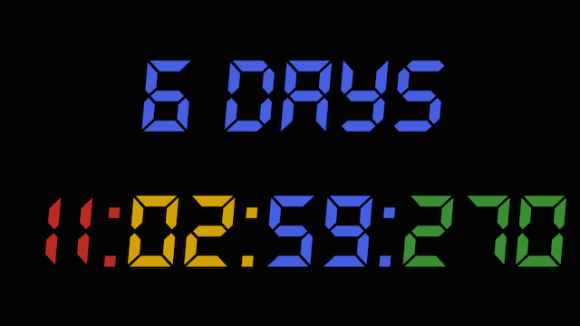

Countdown
=========

This is simply a hacked together project (in a minimum amount of time) for Android which shows a countdown timer and loads an image. In 
addition, long pressing on the time toggles playing a beep sound and long pressing anywhere else presents a fragment for 
selecting the event date / time and image URL. When the countdown completes an image is loaded from the URL.

##Getting started

###Event image URL
Long press anywhere but the days (if they are showing).

###Event time
Long press anywhere but the days (if they are showing).

###Font size
Change the size of the font in the dimens.xml to suit your screen.

#Licence

    Copyright 2016 Julius Spencer
    
    Licensed under the Apache License, Version 2.0 (the "License");
    you may not use this file except in compliance with the License.
    You may obtain a copy of the License at
    
        http://www.apache.org/licenses/LICENSE-2.0
    
    Unless required by applicable law or agreed to in writing, software
    distributed under the License is distributed on an "AS IS" BASIS,
    WITHOUT WARRANTIES OR CONDITIONS OF ANY KIND, either express or implied.
    See the License for the specific language governing permissions and
    limitations under the License.
